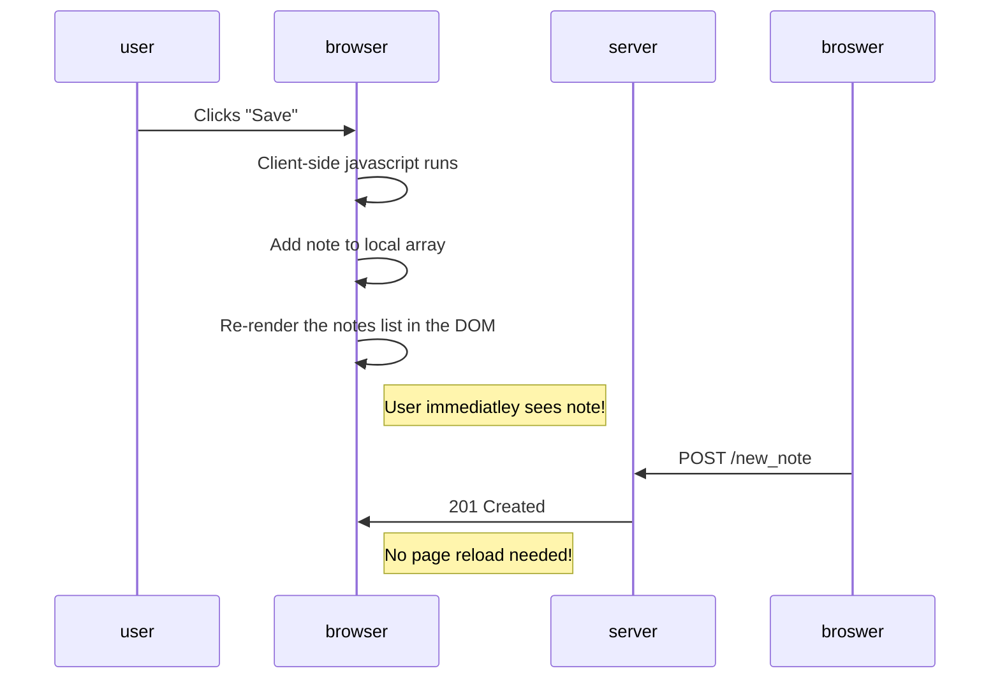

```mermaid
sequenceDiagram
    participant user
    participant browser
    participant server

    user->>browser: Clicks "Save"
    browser->>browser: Client-side javascript runs
    browser->>browser: Add note to local array
    browser->>browser: Re-render the notes list in the DOM
    Note right of browser: User immediatley sees note!
    broswer->>server: POST /new_note
    server->>browser: 201 Created
    Note right of browser: No page reload needed!
```

